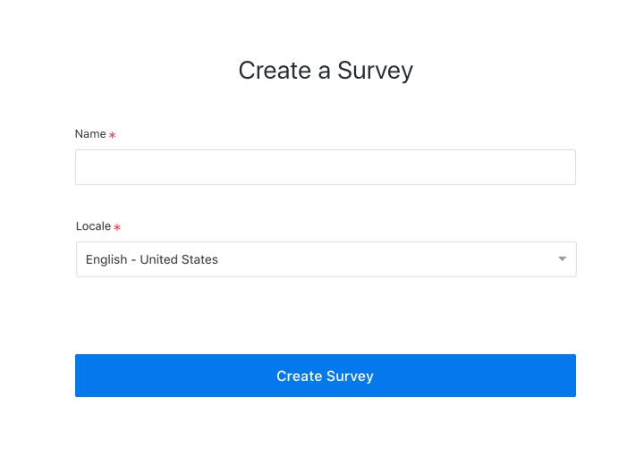

# Product Engineer Code Sample

Lucid is the world’s largest audience platform for sourcing and understanding real, deterministic data about human behavior at scale. The company has built the largest and most powerful programmatic survey exchange.

We'd like you to build a small app using our official API to create a survey on the platform according to these [instructions](#instructions).

## Evaluation

This app could be written in many different ways. The main things we are looking for are how you approach:

- component organization
- state management
- data fetching
- error handling

## Help

It's not necessary to spend more than a few hours on this assignment. One of our teammembers will be available for you to ask as many questions as you need.

## Requirements

- implement the app using [react](https://github.com/facebook/react)

## Instructions

Please implement a form to create a new survey. A [mockup](./create-survey-form.png) is provided for visual reference on the inputs that should be included and how the form should look. It does not need to be pixel perfect. You'll need to fetch the locales that are supported on our platform to populate the select component. In addition to the form, add a "Success!" view that can look however you'd like.




### API Notes

#### Fetching Locales
The data for the `Locale` input can be fetched using the [/dictionary-beta/locales](https://developer.lucidhq.com/#dictionary-beta) endpoint. See the [documentation](https://developer.lucidhq.com/#dictionary-beta) for an example response payload.

```sh
curl -H "Authorization: YOUR_API_KEY_HERE" "https://stg-api.samplicio.us/demand/v2-beta/locales"

```

#### Creating A Survey
The new survey can be created using the [post-create-a-survey-beta](https://developer.lucidhq.com/?shell#post-create-a-survey-beta) endpoint. Modify this example JSON payload with the `name` and `locale` collected by the app.

```sh
curl -H "Content-Type: application/json" -H "Authorization: YOUR_API_KEY_HERE" -X POST --data '{ "business_unit_id": 1056, "client_cpi_usd": 5, "collects_pii": true, "expected_completes": 10, "expected_completion_loi": 10, "expected_incidence_rate": 0.1, "fraud_profile": true, "fraud_profile_threshold": 13, "industry": "education", "live_url": "https://www.samplesurvey.com/", "locale": "eng_us", "name": "Test Survey", "priority": 13, "quantity_calc_type": "prescreens", "project_id": 124973, "relevant_id": true, "status": "pending", "study_type": "ihut", "survey_cpi_usd": 5, "test_url": "https://www.samplesurvey.com/test", "unique_ip": true, "unique_pid": true, "verify_callback": true
}' https://stg-api.samplicio.us/demand/v2-beta/surveys
```

## Quickstart

Feel free to set up the project however you think best; however, if you'd like to skip the rigamarole of setting up the app, instructions are provided below to use [create-create-app](https://github.com/facebook/create-react-app).

```sh
npx create-react-app .
npm start
```
